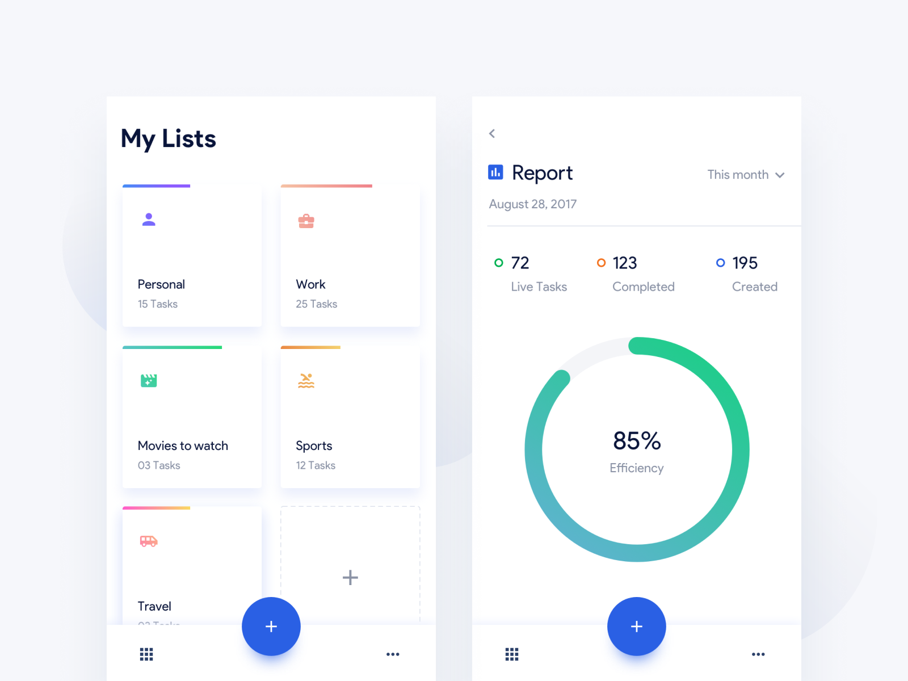

# Task Management App

This is a task management app built with React Native and Expo.

Still in progress...

## Features

- Create task categories
- Add tasks to categories
- View tasks in each category
- Persist tasks using AsyncStorage

## Screenshots

## Getting Started

### Prerequisites

- Node.js
- Expo CLI
- iOS or Android emulator

### Installation

1. Clone the repo

`git clone https://github.com//task-app.git`

2. Install dependencies

`npm install`

3. Start the app

`npx expo start`

## Project Structure

- `App.js` - Main app component
- `src/screens/` - React Native screens
  - `HomeScreen.js` - Displays categories
  - `CategoryScreen.js` - Add new categories
  - `TaskScreen.js` - View/add tasks for a category
  - `AddTaskScreen.js` - Add a new task
  - `ReportScreen.js` - View tasks across categories
- `src/components` - Reusable React components
  - `TaskList.js` - Displays category list
- `src/navigation` - Navigation related files  

## Built With

- [React Native](https://reactnative.dev/) 
- [Expo](https://expo.io/)
- [React Navigation](https://reactnavigation.org/)
- [AsyncStorage](https://react-native-async-storage.github.io/async-storage/) 

## Author

- [Emanuel Juricev](https://github.com/EmanuelJrc)

## License

This project is licensed under the MIT License - see the [LICENSE.md](LICENSE.md) file for details.
